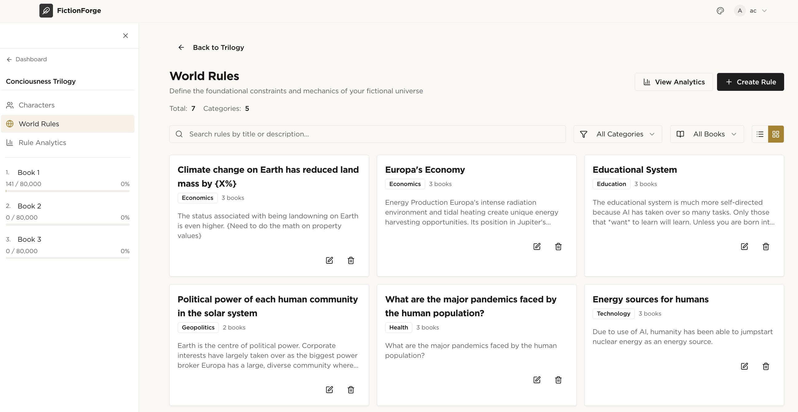
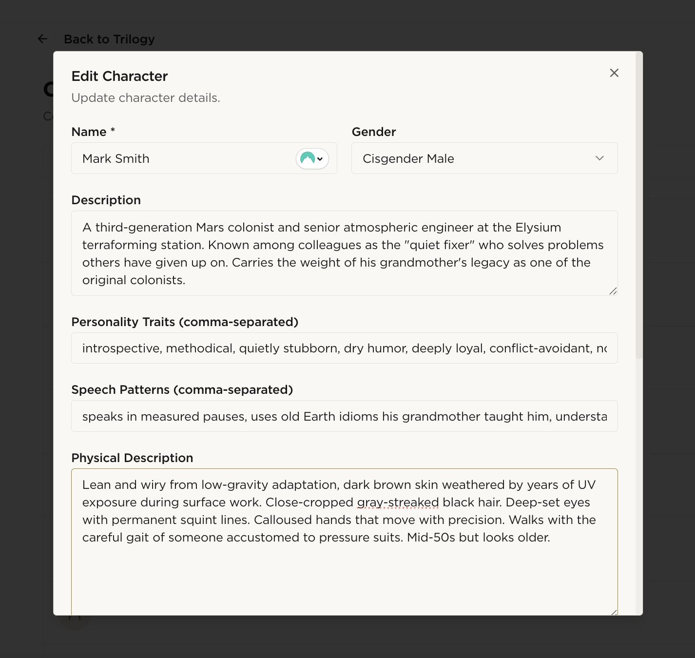
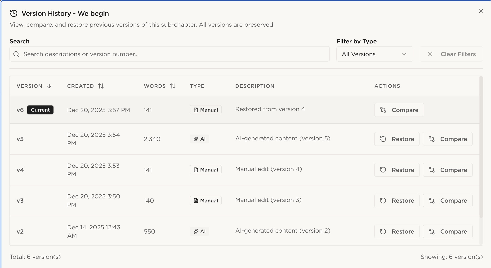

# Learnings from FictionForge: I built an new open source app for novel writing 

## Writing = For the privileged few

I've been a voracious reader forever. And while, yes, I do read business books, my true joy is fiction. Sci-fi, fantasy, American literature (mid-century, please), poems, Canadian lit, etc. I read as often as possible, and if you've seen me walking around Toronto, odds are that I had a fiction book somewhere in my bag, my pocket, or my hand. And like a lot of people - Over 50% of Americans from a survey in 2021 (Sheldon) - I have often wished I could write a book. 

But writing is a privilege - You usually need time, money, and education to do it. People born with a silver spoon are over-represented in the Western canon precisely for this very reason. The middle and upper classes are over-represented in creative industries (see table below for a breakdown of the breakdown of creatives)

### Class Origin Breakdown for Creative Industries (UK, 2014)

| Class Origin | % in Creative Industries | % in General Population |
|--------------|--------------------------|-------------------------|
| NS-SEC 1 (Higher professional & managerial) | 26.1% | 14.1% |
| NS-SEC 2 (Lower professional & managerial) | 23.9% | 15.0% |
| NS-SEC 3-5 (Intermediate occupations, small employers, self-employed) | 32.0% | 36.2% |
| NS-SEC 6-8 (Semi-routine, routine, long-term unemployed) | 18.0% | 34.7% |
Source: O'Brien

While I was not born without privilege, I still have a day job to pay the bills - So while thinking more and more about what I would write, I also worried that I would have a hard time diving back into the context of whatever I was writing with the odd hours I would be snatching away to write. 

And because its me, I was also thinking about process and systems and strategy (oh my!) - To write is also to edit; To create a world, and then only show the parts that are relevant to the story, and no one can do both things at once. These steps have to be done sequentially. Philip Pullman of the His Dark Materials series (No, I absolutely refuse to watch the film adaptations) writes eight pages a day, and edits the pages down to one page the following day. I would love to follow that process, but writing 8 pages a day while working full-time, teaching at U of T, and advising various groups makes this very difficult to do.

So, I needed a sustainable process that would allow me to write ~80,000 words over a year, while keeping up my other commitments.

## Could AI lower those barriers?

So, I needed a sustainable process that would allow me to write ~80,000 words over a year, while keeping up my other commitments.

Which made me wonder: could AI lower those barriers?

In parallel to the above, I've been building a lot of AI systems. Over the last year, I've built and sold a tax automation platform to the largest tax accounting firm globally (more updates to come on that), an agentic ERP for my partner's business, an Indian classical music streaming app, and am developing a plug and play ethical layer for AI.  

Part of this activity has been motivated by a visceral motivation - I love building things. 

But I've also been curious, from a societal perspective - What is the real benefit of generative AI built on the principles probabilistic language generation?

There are a few theses I've been exploring (not because I believe in them, but because they are part of the common discourse, and I'm curious to see if I can prove them or their null hypotheses out). One of the common arguments of AI advocates is that AI will free humans for creative work. On the other hand, skeptics claim that AI will replace creative work. 

While I don't claim to have an answer from one project, its an interesting data point. So I set out to create an app that would let me test this hypothesis.


## What I built

The core challenge is that if AI is going to help me write, it needs to sound like *me*, not like a generic LLM trained on internet text. 

And if I'm going to use AI-generated content in a novel, there needs to be a clear audit trail so editors and publishers know exactly what was human-written versus machine-generated.

So I built an app around two architectural bets:
1. Character-Specific RAG. Each character gets their own vector embeddings, trained on writing samples I provide for their voice. When the AI generates content from a character's perspective, it retrieves from that character's embedding space—not from generic training data. The hypothesis: this would let AI approximate distinct voices rather than collapsing everyone into the same LLM tone.
2. Transparent version control. Every piece of content is automatically labeled "AI-generated" or "human-generated" with full revision history. If this ever becomes a publishable manuscript, anyone can trace exactly which words came from where.
I software architected the platform myself, then built it in 20 hours using Claude Code.

The app is called FictionForge, and it generates creative writing from writer-inputted plot points, characters, and world rules. 

I software architected the platform myself, and then built it in 20 hours in November 2025 using Claude Code.



*Screenshot of world rules that can be stored in FictionForge. FF can check your narrative against world rules to identify conflicts.*



*Screenshot of character information stored in FictionForge. FF can use this information, combined with writing samples for the voice of each character to generate creative writing from that character's perspective.*

Creative writing is labeled as either "AI generated" or "human generated" with version control. The idea is that if anyone using this app decided to use the AI features for generating content, editors and publishers could see a complete audit trail of exactly which content was generated with AI when making determinations about their comfort level and any necessary contract clauses when deciding whether to offer a book deal.


*Screenshot of version control, which automatically labels content as AI-generated or human-generated. Key for publisher and editor audit functionalities - And for writers to keep track themselves!*

Other software functions and business requirements
- Trilogy project management with automatic 3-book structure creation
- Character profiles with personality traits, arcs, and "consciousness themes"
- World-building rules engine with book-specific applicability
- Chapter and sub-chapter (scene) planning with drag-and-drop reordering
- Character-Specific RAG: separate vector embeddings per character to maintain distinct voices
- World Rule RAG: semantic retrieval of applicable rules during content generation
- AI-powered content generation via AWS Bedrock (Mistral LLM)
- Real-time generation progress tracking via WebSocket
- Full version control with revision history, diff viewing, and restore
- Async job queue for long-running generation tasks
- Full user auth, including the ability to have multiple users. Future functions will allow writers to share specific parts of their novel with editors and commentors.

Other fun things
- Three different themes: Dark mode, light mode, and paper & pen mode

- Context aware side bar

Software architecture
- **Backend**: Python FastAPI with async support, Pydantic data validation, 8 API routers, 19 service modules
- **Frontend**: React 18 + TypeScript, Vite build tool, Tailwind CSS, shadcn, Radix UI components, Zustand state management
- **Database**: Supabase (PostgreSQL) with Row-Level Security for multi-tenant isolation
- **Vector Database**: ChromaDB for character and world-rule embeddings (sentence-transformers)
- **AI Integration**: AWS Bedrock via Lambda + API Gateway (Mistral 7B Instruct)
- **Async Processing**: Redis cache + Arq job queue for background generation tasks
- **Real-time**: WebSocket connections for live progress updates

```
┌─────────────────────────────────────────────────────────────────┐
│                     React Frontend                              │
│        (TypeScript, Vite, Tailwind, Radix UI, Zustand)         │
└─────────────────────────┬───────────────────────────────────────┘
                          │ REST API + WebSocket
                          ▼
┌─────────────────────────────────────────────────────────────────┐
│                    FastAPI Backend                              │
│              (Python 3.11+, Pydantic, Async)                    │
│  ┌─────────────────┐  ┌─────────────────┐  ┌─────────────────┐  │
│  │ Character RAG   │  │ World Rule RAG  │  │  Job Manager    │  │
│  │   Generator     │  │    Provider     │  │   (Arq Queue)   │  │
│  └────────┬────────┘  └────────┬────────┘  └────────┬────────┘  │
└───────────┼────────────────────┼────────────────────┼───────────┘
            │                    │                    │
            ▼                    ▼                    ▼
┌───────────────────┐  ┌─────────────────┐  ┌─────────────────────┐
│     ChromaDB      │  │   Supabase      │  │    AWS Bedrock      │
│  (Vector Store)   │  │  (PostgreSQL)   │  │  (Mistral 7B LLM)   │
│                   │  │                 │  │                     │
│ • Character       │  │ • User Auth     │  │  ┌───────────────┐  │
│   Embeddings      │  │ • Trilogy Data  │  │  │    Lambda     │  │
│ • World Rule      │  │ • Versions      │  │  │  + API GW     │  │
│   Embeddings      │  │ • RLS Security  │  │  └───────────────┘  │
└───────────────────┘  └─────────────────┘  └─────────────────────┘
            │                    │                    │
            └────────────────────┼────────────────────┘
                                 ▼
                    ┌─────────────────────┐
                    │       Redis         │
                    │  (Cache + Queue)    │
                    └─────────────────────┘
```

# Failure or Success? Project Assessment

So did it work? 

In some ways - Yes.

But in ways central to the experiment - No.

Yes, I am using it to attempt to write a novel (and fixing bugs, creating more functions and features as I go. Fork the repo for updates!). I'm finding the world building, character tracking, and chapter planning features to be particularly useful.

But in terms of replicating my voice - The app is a failure. The AI's voice is not bad. It's just not mine.


# Root Cause Analysis
So, why did the project fail ultimately? 

Sure, technological and technical challenges play a part - I did not spend weeks and months calibrating the RAG system. But I think the problem is more fundamental.

Probabilistic AI models are built on data that is already out there - Created by a capitalist system that churns out language for a specific purpose in a specific way (many thanks to Steve Wright for pointing this out in one of his many LinkedIn posts on the subject). The bias in LLM training data is well-documented. with some examples summarized below:


1. *Wikipedia Editors (major training source):* The demographics of Wikipedia editors are heavily unbalanced. According to Wikipedia itself, a disproportionate majority of its editors are males (87%), and in particular males in their mid-20s or retired males (Navigli).
2. *Western Overrepresentation:* LLMs trained on predominantly English text exhibit a latent bias favoring Western cultural values, especially when prompted in English. If a generative text model is trained on texts predominantly authored by male, white, and Western writers, it risks perpetuating their perspectives and stereotypes, neglecting diversity (Tao et al.)

The existing data used to train AI systems is likely to overrepresent content generated by Western men, particularly white men (Liu).  

# Conclusion

The central failure of this project yields an important lesson - If you have a unique voice that falls outside of the above, then AI is going to have a hard time replicating that. But it can help create the system and processes needed to accelerate the development of your own voice. 

FictionForge is now open source. Fork it, improve it, use it to write something only you could write.

https://github.com/AnshulaChowdhury/FictionForge

## References

1. Navigli, Roberto, Simone Conia, and Björn Ross. "Biases in Large Language Models: Origins, Inventory, and Discussion." ACM Journal of Data and Information Quality, vol. 15, no. 2, 2023, pp. 1–21. https://doi.org/10.1145/3597307.
2. Liu, Zhaoming. "Cultural Bias in Large Language Models: A Comprehensive Analysis and Mitigation Strategies." Journal of Transcultural Communication, vol. 3, no. 2, 2023, pp. 224–244. https://doi.org/10.1515/jtc-2023-0019.
3. O'Brien, Dave, et al. "Are the Creative Industries Meritocratic? An Analysis of the 2014 British Labour Force Survey." Cultural Trends, vol. 25, no. 2, 2016, pp. 116-131. LSE Research Online, eprints.lse.ac.uk/66499/. 
4. Sheldon, Ashly Moore. "Half of Americans Think They've Got a Good Idea for a Novel." ThriftBooks, 2 Nov. 2021, www.thriftbooks.com/blog/nanowrimo-time-lets-go/.
5. Tao, Yan, Olga Viberg, Ryan S. Baker, and René F. Kizilcec. "Cultural Bias and Cultural Alignment of Large Language Models." PNAS Nexus, vol. 3, no. 9, 2024, pgae346. https://doi.org/10.1093/pnasnexus/pgae346.